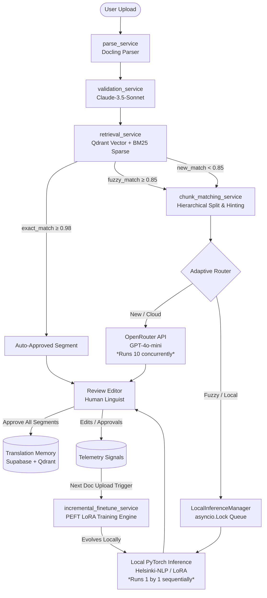

# TranslateIQ Project Documentation (Current State V2)

This document provides a comprehensive technical analysis of the TranslateIQ platform, an adaptive machine translation system. This assessment is based strictly on the current codebase, including the latest hierarchical chunking, JIT fine-tuning optimizations, and the Local Inference Engine queue.

---

## 1. COMPLETE PROJECT OVERVIEW

**TranslateIQ** is an enterprise-grade Adaptive Machine Translation (MT) platform. It solves the high cost and variability of using LLMs for large-scale translation by integrating a **Translation Memory (TM)** as a first-class citizen alongside a **Just-In-Time (JIT) Incremental Learning** pipeline and purely local edge AI models.

**End-to-End User Experience:**
1.  **Upload**: User uploads a `.docx` or `.pdf` file.
2.  **Parsing**: The system uses **Docling** to atomize the document into segments (paragraphs, headings, lists).
3.  **Validation**: Automated checks (RegEx + LLM) identify formatting, punctuation, and terminology inconsistencies.
4.  **Classification**: Each segment is checked against the TM using **Hybrid Search (BM25 + BGE-M3 Vector)**. Segments are tagged as **Exact**, **Fuzzy**, or **New**.
5.  **Translation**: 
    *   **Exact matches (Score ≥ 0.98)** are pulled directly from TM (Cost: $0).
    *   **New segments (Score < 0.85)** are routed out via parallel batches of 10 to **GPT-4o-mini** via OpenRouter.
    *   **Fuzzy segments (Score ≥ 0.85)** trigger Adaptive Routing. They bypass the cloud securely, enter the `LocalInferenceManager` queue, and are translated sequentially (1-by-1) using a local PyTorch `Helsinki-NLP` project-specific LoRA model.
6.  **Review**: Translators review segments in the **Review Editor**, where they can accept, edit, or reject. Approving generates a "Telemetry Signal".
7.  **Export**: The system reconstructs a new DOCX file with the approved translations, maintaining the original document hierarchy.

---

## 2. CURRENT SYSTEM ARCHITECTURE

### Backend Architecture (`backend/app/`)
*   **API Layer**: FastAPI handling web requests via Uvicorn.
*   **Service Layer (`app/services/`)**:
    *   `parse_service.py`: Document atomization via `Docling`.
    *   `validation_service.py`: Heuristics + `Anthropic/Claude-3.5-Sonnet` terminology scanner.
    *   `chunk_matching_service.py`: Matches segments hierarchically (Full -> Sentence -> Phrase) using `retrieve_tm_matches`.
    *   `retrieval_service.py`: Hybrid Search via `BM25Okapi` and `Qdrant`. Merges scores using Reciprocal Rank Fusion.
    *   `classification_service.py`: Language normalization and TM type classification.
    *   `translation_service.py`: Contains Parallel Batch Translation (`asyncio.gather`) and handles the `LocalInferenceManager` queue (using `asyncio.Lock()`) for threading PyTorch inference gracefully out of the web server loop.
    *   `incremental_finetune_service.py`: JIT engine integrating PEFT/LoRA fine-tuning on human deltas + a replay buffer.
    *   `mtqe_service.py`: Machine Translation Quality Estimation heuristic logic.
    *   `export_service.py`: Reconstructs `.docx` via `python-docx`.

### Data Flow Diagram

---

## 3. CORE LOGIC / ALGORITHMS

### Local Inference & Concurrency Logic
*   **Problem:** Translating 10 segments simultaneously using PyTorch causes 100% CPU/GPU starvation and crashes.
*   **Logic:** `translation_service.py` manages translation in chunks of `TRANSLATION_BATCH_SIZE=10`. 
*   **Cloud Routing:** Segments needing the Cloud (OpenRouter) are fired immediately via `asyncio.gather` for max speed.
*   **Local Routing:** Segments that can be handled locally enter the `LocalInferenceManager`. A global `asyncio.Lock()` enforces a FIFO priority queue, so PyTorch only ever translates ONE fuzzy segment at a exact moment. Wait threads use `asyncio.to_thread` to not block FastAPI. 
*   If PyTorch is missing (`ImportError`), it uses a non-blocking `time.sleep()` proxy simulation lock to ensure translators aren't stopped locally.

### Reciprocal Rank Fusion (RRF)
Implemented in `retrieval_service.py`:
1.  **BM25**: Keyword-sparse search (rank 1–100).
2.  **Dense**: BGE-M3 vector semantic search (rank 1–100).
3.  **RRF Formula**: `RRF_Score = (1 / (60 + BM25_Rank)) + (1 / (60 + Dense_Rank))`
*   Combines exact acronym matching with broad fuzzy concept recognition without volatile weighting. The final confidence relies on averaging the normalized BM25 score with the absolute Cosine Similarity from Qdrant.

### Hierarchical Stitching
*   If a paragraph is 4 sentences long, and the TM has exactly 3 of those sentences:
*   The system extracts those 3 sentences immediately.
*   Only the 1 missing sentence is shipped to the LLM (OpenRouter or Local Model).
*   The result is "Stitched" logically back together.

### JIT Continuous Learning Strategy
*   **Condition:** `is_trained == False` AND `signal_label == "desirable"`
*   **Replay Buffer Constraint:** 15 random historically trained segments are added.
*   **Algorithm:** Rather than training over the full TM daily, LoRA (Low-Rank Adaptation) targets only <1% of model weights dynamically over 1 Epoch, keeping fine-tune evolution time to under 15 seconds.

---

## 4. COMPLETE TECH STACK

**Frontend UI & State:**
*   `Vite` / `React 18` - Core framework
*   `TailwindCSS` / `Framer Motion` - Styling & dynamic animations
*   `Zustand` - UI state store for Review Editor logic
*   `TanStack Query` - Async backend data caching

**Backend Engine:**
*   `FastAPI` / `Uvicorn` - Performance Python webserver
*   `SQLAlchemy (Async)` - Relational mapping
*   `python-docx` - Binary reconstruction of DOCX schemas
*   `Docling` - Enterprise document structural extractor

**AI Models & Edge Processing:**
*   `OpenRouter (GPT-4o-mini)` - Massive cheap parallel intelligence
*   `OpenRouter (Claude 3.5 Sonnet)` - Specialised single-pass heuristics checks
*   `Helsinki-NLP/opus-mt-en...` - Deep-edge PyTorch Seq2Seq fallback and learning model
*   `HuggingFace (Transformers + PEFT)` - Dynamic Local LoRA Adapter application manager

**Databases:**
*   `Supabase (PostgreSQL)` - Standard normalized storage (Projects, Users, Telemetry, Review State)
*   `Qdrant` - Specialised Float Array Vector Storage (BGE-M3 format)
